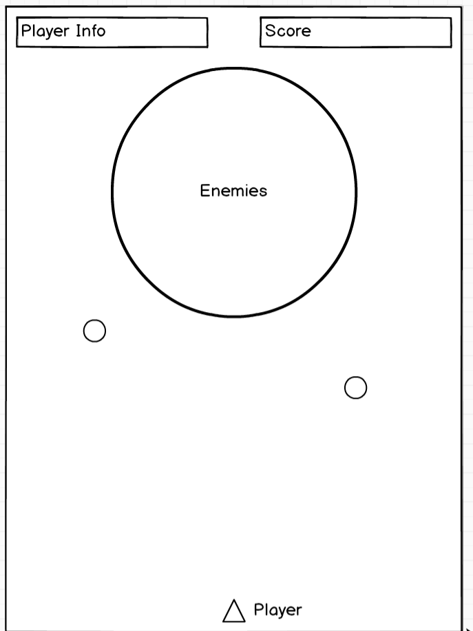

## Valkyrie

### Background

Valkyrie is a classic bullet hell game. The player plays as some kind of ship which will continuously shoot bullets at enemies, each of which would have a different attack pattern to shoot back at the player. The end goal would be to survive and destroy the "boss" at the end of the game. Like all arcade-like games, it would ideally be topped off with a scoreboard to list player rankings.

### Functionality & MVP  

The minimum viable product will include:

- [ ] Functioning shooting and destroying of enemies
- [ ] Many types of enemies for more dynamic gameplay
- [ ] Fluid movement of player and enemies

In addition, this project will include:

- [ ] A start screen with instructoins
- [ ] A production Readme

### Wireframes

This app will consist of a single screen, which will render between a start screen and a scoreboard. The game controls will consist of the arrow keys to move the ship, spacebar to shoot, and 'z' to activate a special attack. Player info will be in the top left while the score counter will be in the top right. Enemies will slowly fly downwards as the game progresses.

### Architecture and Technologies

This project will be implemented with the following technologies:

- Vanilla JavaScript and `jquery` for overall structure and game logic,
- `Easel.js` with `HTML5 Canvas` for DOM manipulation and rendering,
- Webpack to bundle and serve up the various scripts.

In addition to the webpack entry file, there will be four main scripts involved in this project:

`ship.js`: this script will house all the basic logic for the player, i.e. movement, shooting, and etc.

`enemies.js`: this script will house all of the basic enemy attributes, such as their speed, movement type, enemy type, health points, etc. The enemies will be split into other sub-groups that will inherit this parent class. They will differ in more complex attributes such as their attack patterns.

`bullets.js`: this script will the different kinds of bullets that will be shot by either the enemy or the player.

`game.js`: this script will handle the game logic, such as the start screen and when the game is over as well as the scoring.

### Implementation Timeline

**Day 1**: Setup all the necessary Node modules, create `webpackconfig.js` and `package.json`, and learn how to render objects using `Easel.js`. Write up the bare bones structure of the four scripts.

**Day 2**: Fully understand what is needed from `Easel.js` and understand how to render continuously, flesh out the `game.js` more fully, and get the player `ship.js` working relatively smoothly with one basic bullet type.

  - `ship.js` constructor and update function
  - basic key controls added with proper movement.
  - `bullet.js` constructor working.
  - `game.js` game logic fully functioning

**Day 3**: Work on getting all the enemies fleshed out, including their movement types and attack patterns. Finish up creating different types of bullets.

  - `enemies.js` constructor and update functions
  - flesh out attack and movement patterns

**Day 4**: Populate the game with enemies and polish up styling and animations. Add scoreboard and bonus features if time allows.

### Bonus features

Some bonus features may be:

- [ ] Score counter and ranking
- [ ] Boss fight
- [ ] Different difficulties
